# Phase 2 ER diagram

Reviewed 2026-10-06. Each line is a physical FK (optional targets permit NULL); composite ownership keys are detailed in schema.prisma. Every child references a stable parent with RESTRICT deletion. See FIELD_DICTIONARY.md for fields.

```mermaid
erDiagram
  User ||--o{ UserRole : "userId"
  Role ||--o{ UserRole : "roleId"
  Role ||--o{ RolePermission : "roleId"
  Permission ||--o{ RolePermission : "permissionId"
  User ||--o{ UserScope : "userId"
  Branch |o--o{ UserScope : "branchId"
  Department |o--o{ UserScope : "departmentId"
  Warehouse |o--o{ UserScope : "warehouseId"
  Branch ||--o{ BranchAlias : "branchId"
  VehicleType ||--o{ Vehicle : "typeId"
  StorageCondition ||--o{ Vehicle : "storageConditionId"
  ProductCategory |o--o{ ProductCategory : "parentId"
  Route ||--o{ RouteRevision : "routeId"
  User ||--o{ RouteRevision : "createdById"
  RouteRevision ||--o{ RouteStop : "routeRevisionId"
  Branch ||--o{ RouteStop : "branchId"
  ScheduleTemplate ||--o{ TemplateRevision : "templateId"
  RouteRevision ||--o{ TemplateRevision : "routeRevisionId"
  User ||--o{ TemplateRevision : "createdById"
  TemplateRevision ||--o{ TemplateWeekday : "templateRevisionId"
  TemplateRevision ||--o{ TemplateStopCategory : "templateRevisionId"
  RouteStop ||--o{ TemplateStopCategory : "routeStopId"
  ProductCategory ||--o{ TemplateStopCategory : "categoryId"
  PlanRevision |o--o{ DailyPlan : "publishedRevisionId"
  DailyPlan ||--o{ PlanRevision : "planId"
  User ||--o{ PlanRevision : "createdById"
  User |o--o{ PlanRevision : "publishedById"
  PlanRevision ||--o{ PlanBranch : "planRevisionId"
  Branch ||--o{ PlanBranch : "branchId"
  DailyPlan ||--o{ Trip : "planId"
  Trip ||--o{ TripRevision : "tripId"
  PlanRevision ||--o{ TripRevision : "planRevisionId"
  TemplateRevision |o--o{ TripRevision : "templateRevisionId"
  RouteRevision |o--o{ TripRevision : "routeRevisionId"
  Vehicle |o--o{ TripRevision : "vehicleId"
  Driver |o--o{ TripRevision : "driverId"
  TripRevision ||--o{ TripStop : "tripRevisionId"
  Branch ||--o{ TripStop : "branchId"
  TripStop ||--o{ TripStopCategory : "stopId"
  ProductCategory ||--o{ TripStopCategory : "categoryId"
  Vehicle ||--o{ VehicleReservation : "vehicleId"
  TripRevision ||--o{ VehicleReservation : "tripRevisionId"
  User ||--o{ Consignment : "requesterId"
  Department ||--o{ Consignment : "departmentId"
  Warehouse ||--o{ Consignment : "sourceWarehouseId"
  Branch ||--o{ Consignment : "destinationBranchId"
  ConsignmentAssignment |o--o{ Consignment : "currentAssignmentId"
  Consignment ||--o{ ConsignmentItem : "consignmentId"
  ConsignmentCategory ||--o{ ConsignmentItem : "categoryId"
  Consignment ||--o{ ConsignmentPackage : "consignmentId"
  Branch |o--o{ AddressSnapshot : "branchId"
  User ||--o{ AddressSnapshot : "createdById"
  Consignment ||--o{ ConsignmentAssignment : "consignmentId"
  Trip ||--o{ ConsignmentAssignment : "tripId"
  TripRevision ||--o{ ConsignmentAssignment : "tripRevisionId"
  TripStop ||--o{ ConsignmentAssignment : "stopId"
  AddressSnapshot ||--o{ ConsignmentAssignment : "senderSnapshotId"
  AddressSnapshot ||--o{ ConsignmentAssignment : "recipientSnapshotId"
  ConsignmentAssignment |o--o{ ConsignmentAssignment : "previousAssignmentId"
  User ||--o{ ConsignmentAssignment : "approvedById"
  User ||--o{ IdempotencyRecord : "actorId"
  Consignment ||--o{ ConsignmentEvent : "consignmentId"
  User ||--o{ ConsignmentEvent : "actorId"
  IdempotencyRecord |o--o{ ConsignmentEvent : "idempotencyId"
  ConsignmentEvent |o--o{ ConsignmentEvent : "compensatesEventId"
  ConsignmentEvent ||--o{ ReceiptLine : "eventId"
  Consignment ||--o{ ReceiptLine : "consignmentId"
  ConsignmentItem |o--o{ ReceiptLine : "itemId"
  ConsignmentPackage |o--o{ ReceiptLine : "packageId"
  Consignment ||--o{ Attachment : "consignmentId"
  User ||--o{ Attachment : "uploaderId"
  ConsignmentAssignment ||--o{ LabelVersion : "assignmentId"
  LabelVersion ||--o{ LabelPackage : "labelVersionId"
  ConsignmentPackage ||--o{ LabelPackage : "packageId"
  LabelVersion ||--o{ PrintEvent : "labelVersionId"
  User ||--o{ PrintEvent : "actorId"
  User ||--o{ ImportBatch : "createdById"
  ImportBatch ||--o{ ImportRow : "batchId"
  User ||--o{ AuditLog : "actorId"
  IdempotencyRecord |o--o{ AuditLog : "idempotencyId"
```

