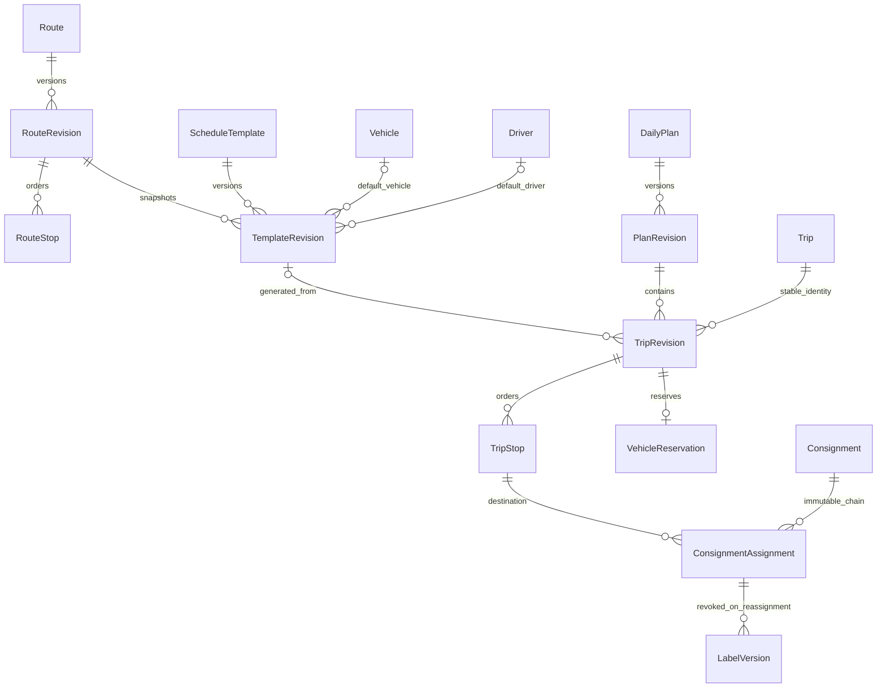

# Phase 4 planning design — 2026-10-06

Reviewed against the existing 52-model schema, immutable triggers, permission matrix and Phase 4 acceptance. The three existing migrations are preserved. Migration 004 is additive; it adds explicit VAN_SALES, nullable trip notes/load quantity/unit and immutable template vehicle/driver, kind, occupancy minutes, arrival day offset, buffer and notes. Foreign keys restrict deletion. Quantities are DECIMAL(14,3); known load/capacity comparisons require matching units. Occupancy template minutes are offsets from Bangkok service-date midnight, 0–4319; arrival offset is 0–2 days. Existing loading/departure/arrival clock minutes remain 0–1439. Null is unknown.

Route and template edits append immutable revisions under the global eligibility lock with optimistic identity versions. For a service date, the highest numbered effective revision wins. A new revision does not modify the old effective window or regenerate an existing dated trip. Generation uses a deterministic template-identity/service-date trip ID and the existing unique Trip code; different request keys cannot duplicate the generated trip. Explicit edits are required to change already generated trips.

Every daily edit saves the complete candidate as a new revision under eligibility -> daily plan locks. Published revisions and omitted draft members remain in history. Remove is allowed only for never-published, unassigned draft trips; cancellation preserves stable IDs. Reduction edits ordered stops; merge keeps the target ID and cancels the source. Copy creates a fresh identity. All actions use the same validated draft service. Publication alone writes reservations under sorted vehicle locks and locking overlap reads. Drafts do not reserve vehicles. Preview is advisory; publication rechecks everything transactionally.

Planning administration requires global scope plus explicit capabilities. Dispatcher edits routes/templates/plans; supervisor reads and publishes; administrator retains identity/master duties without implicit operational permissions.

Replacement publication requires an explicit target trip/stop and expected consignment version for every current assignment on the previous revision. Only ASSIGNED and WAREHOUSE_RECEIVED consignments with no departed/loaded/receipt event and no vehicle/branch custody may move. In-motion/completed records block replacement until a later authorized operational workflow exists. Assignment history, address snapshots and package IDs remain intact. New transport snapshots, ASSIGNED events, label revocations, current-assignment pointers, audit and plan publication commit or roll back together. Consignment categories and product coverage categories are distinct taxonomies; no invented mapping is used. Targets must be active outbound trips at the actual destination branch. UI previews disclose affected records and require a reason.

No destructive database reset or production sample import is part of this phase.

## Additive field dictionary and relationships

| Entity / field | Type / nullability | Constraint and meaning |
| --- | --- | --- |
| TripRevision.kind | enum, required | Adds VAN_SALES; historical OTHER retained; only BRANCH_DELIVERY contributes coverage |
| TripRevision.notes | VARCHAR(2000), nullable | Immutable once published |
| TripRevision.plannedLoad / loadUnit | DECIMAL(14,3) / VARCHAR(32), both nullable | Both absent or positive quantity plus explicit unit; no unit conversion or consignment-item summation |
| TemplateRevision.kind | enum, required, default BRANCH_DELIVERY | Defines generation kind; non-outbound generated trip round is null |
| TemplateRevision.vehicleId / driverId | VARCHAR(36), nullable | Restrict FKs to Vehicle / Driver; unavailable masters rejected before new assignment |
| TemplateRevision.occupancyStartMinute / occupancyEndMinute | INTEGER, nullable | Bangkok midnight offsets 0–4319; known start < end |
| TemplateRevision.arrivalDayOffset | INTEGER, required, default 0 | 0–2 days added to existing arrival clock minute |
| TemplateRevision.bufferMinutes | INTEGER, required, default 0 | Explicit 0–1440 trailing buffer; zero is a draft input, not an inferred real operational policy |
| TemplateRevision.notes | VARCHAR(2000), nullable | Copied to generated dated revision; later edits do not rewrite history |

The existing unique `(templateId,number)`, `(routeId,number)`, `(planId,number)`, `(planRevisionId,tripId)`, Trip.code and VehicleReservation.tripRevisionId remain unchanged. Revision numbers use the aggregate maximum, independent of identity version. Immutable history triggers cover newly added fields as part of their existing row guards. No new entity or destructive column conversion: 52 models, four migrations total.

Publication prerequisites exposed in the planner: complete coverage, active branch/category/vehicle/type/storage references, a vehicle, known departure and occupancy interval, correct service date, valid loading/arrival ordering, compatible known capacity and no vehicle overlap including buffer. Driver, loading, arrival and planned load may remain unknown if not required to prove those invariants. Existing null facts are not silently filled. Cancelling an existing dated trip may retain archived provenance/master references; it cannot contribute coverage or obtain a reservation.
